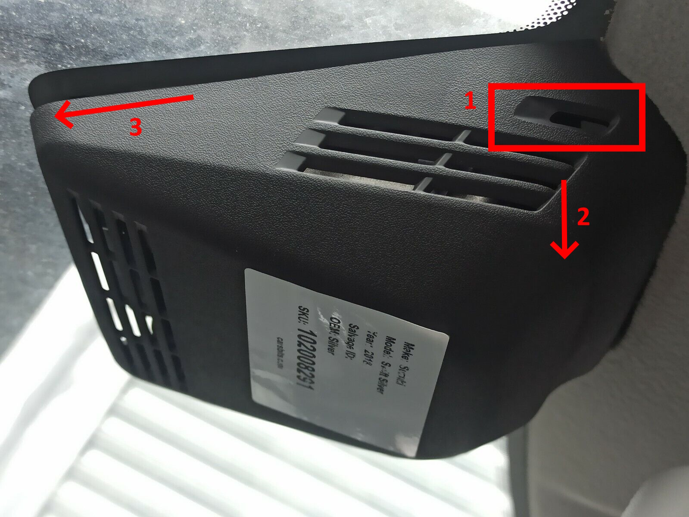
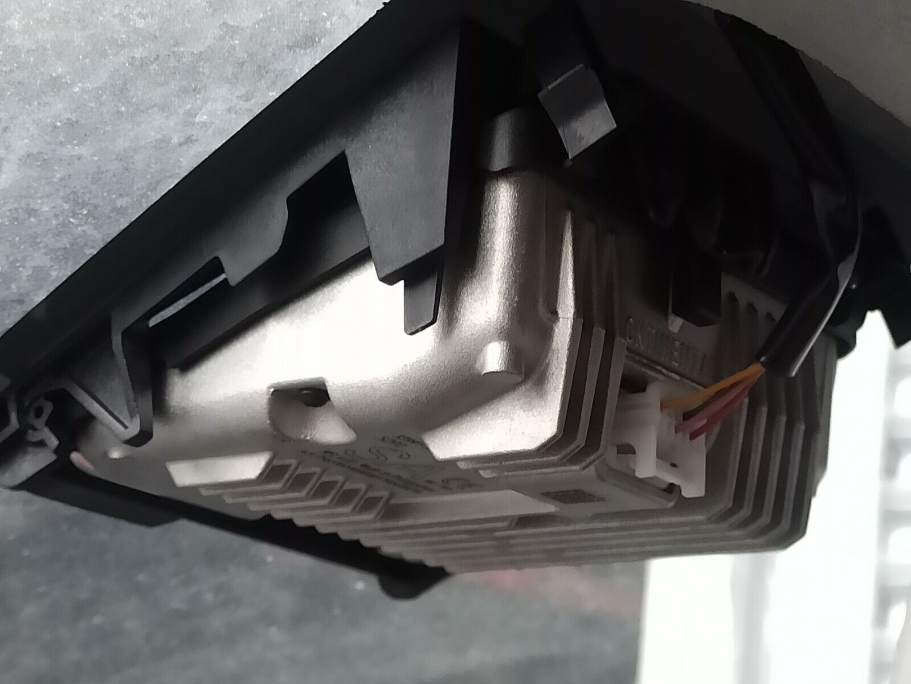
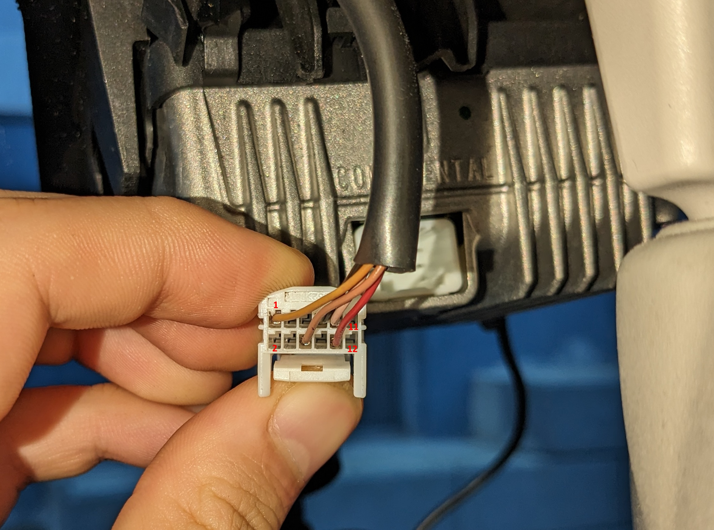
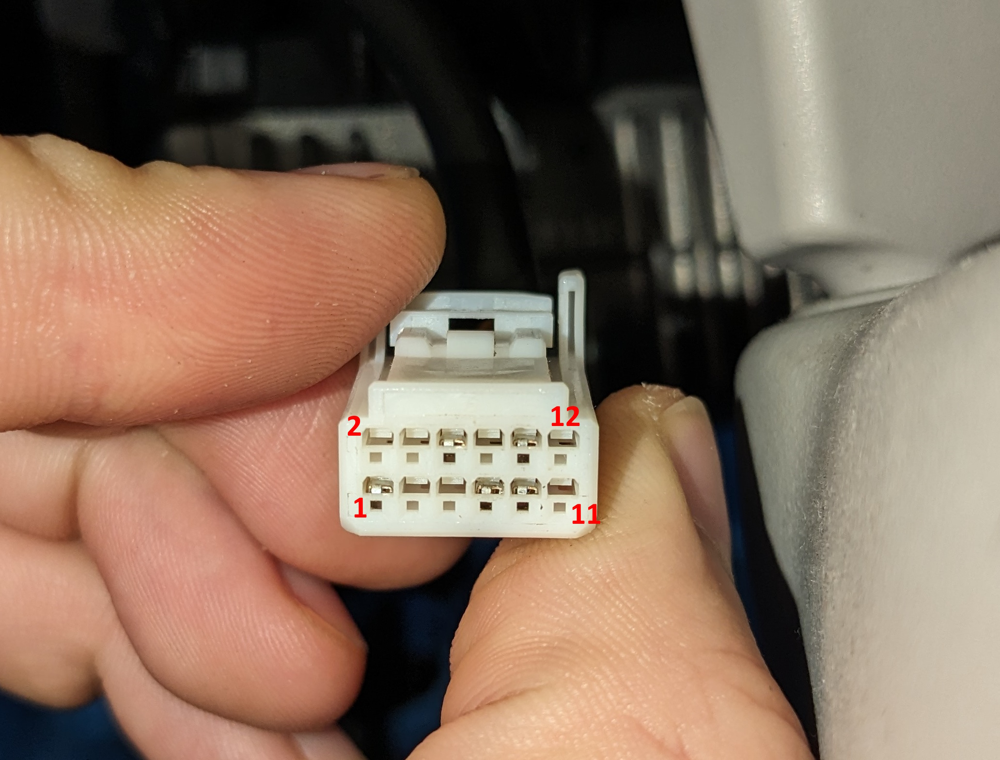

# Try getting into CAN Bus of my Suzuki Swift and some more

- [Try getting into CAN Bus of my Suzuki Swift and some more](#try-getting-into-can-bus-of-my-suzuki-swift-and-some-more)
  - [Information](#information)
  - [Hide the dashcam's power cord](#hide-the-dashcams-power-cord)
    - [Camera connector](#camera-connector)
    - [Wiring the dashcam to the front camera](#wiring-the-dashcam-to-the-front-camera)

## Information

I have a Suzuki Swift AZ from 2017, Gas/Electro soft-hybrid.

Maybe important to say for the second goal is the fact that I have a camera module on my windshield. It's made by Continental.

Goals:

- [X] Install a subwoofer
- [ ] Hide the extremly long power cord for my dashcam
- [ ] Get into the car's CAN bus to read data
- [ ] Use the CAN bus to maybe control some systems

## Hide the dashcam's power cord

My dashcam is currently powered using 5V usin a long Mini-USB cable. I want to replace that by using the power from my camera system. The car's camera system is a Continental MFL400 and has a 12 pin connector on it's back. Opening the camera cover is as easy as grabbing the upper part and pulling is a bit or for the people who want to be gentle. It's held by clips and these can be accessed through the holes marked in the following picture.

After that you will be greeted by this block of metal.

### Camera connector

Looking at it's connector we can see that it's a 12 pin connector with 5 pins used.

The pinout is not complete, but as far as I could find out right now:

| Pin | Color            | Use           |
| --- | ---------------- | ------------- |
| 1   | Orange           | +12V Ignition |
| 2   | NC               | NC            |
| 3   | NC               | NC            |
| 4   | NC               | NC            |
| 5   | NC               | NC            |
| 6   | Yellow-brown (?) | Unknown use   |
| 7   | Black            | Ground        |
| 8   | NC               | NC            |
| 9   | Yellow-brown (?) | Unknown use   |
| 10  | Red              | Unknown use   |
| 11  | NC               | NC            |
| 12  | NC               | NC            |

On Pin 9 I could see a (would guess) 250kHz Signal between 2V and 3V and would guess that this might be the CAN Low signal.

Pin 10 was only checked using multimeter and could see ~2.2V with ignition off and multimedia on. It had ~2.8V with ignition on.

Pin 6 wasn't tested at all from my side. But if I had to guess I would say that pin 6 or pin 9 might be CAN high.

If all my guessing would be correct, than we would have a low-speed CAN bus on the camera. But that's for later use only.

### Wiring the dashcam to the front camera

Now that we know where 12V and GND are, it's pretty easy to buy a DC/DC converter from 12V to 5V and wire the dashcam to that. The dashcam will be powered as soon as the ignition is turned on.
